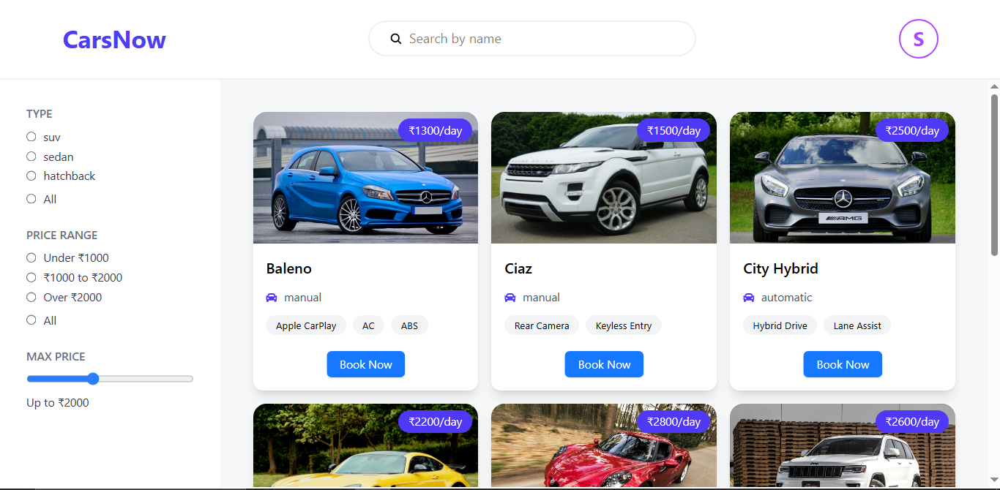
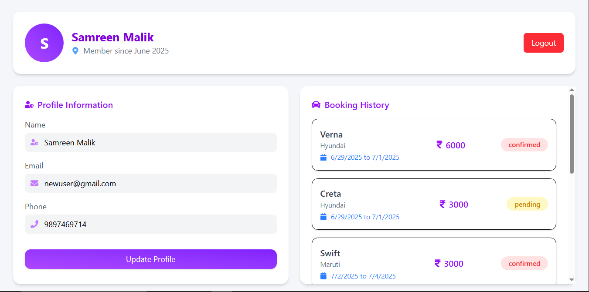
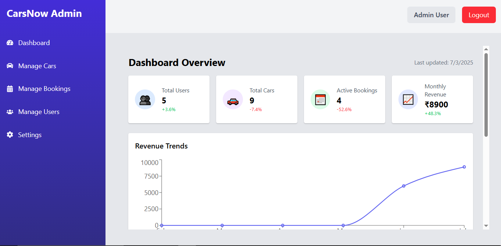
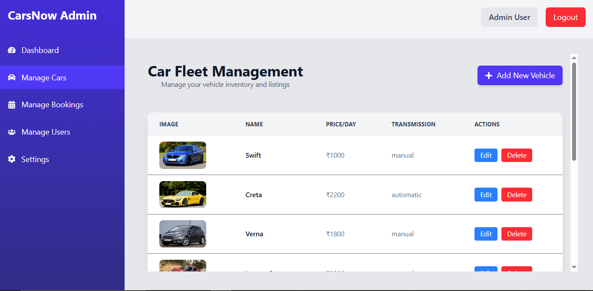

# 🚗 CarsNow – Car Rental Web App

CarsNow is a full-stack **MERN** project where users can **browse** **search**, **filter**, and **book rental cars**, and admins can **manage the car listings** with full CRUD operations admin have dedicated admin panel. Built with modern tech like React,Tailwind CSS, Node.js, Express, MongoDB, Docker, and JWT Auth.

---


---

## 🌟 Features

### 🔐 Authentication

- Register/Login for both Users & Admins
- JWT token-based secure auth
- Protected routes for admin features

### 👥 For Users

- View all cars with details
- Filter cars by category (SUV, Sedan, Hatchback, etc.)
- Filter cars by price range
- Car booking system
- View past bookings
- Update personal profile

---



---



---

### 🛠️ Admin Panel

- Add/Edit/Delete cars
- View all bookings made by users
- Have all user list and can banned user
- Dashboard for see stats and revenue

---



---



## 🖥️ Tech Stack

| Technology   | Role               |
| ------------ | ------------------ |
| React        | Frontend framework |
| Node.js      | Backend runtime    |
| Express.js   | REST API + routing |
| MongoDB      | NoSQL database     |
| Mongoose     | ODM for MongoDB    |
| JWT          | Authentication     |
| Tailwind CSS | Styling            |

---

## ⚙️ Installation

```bash
git clone https://github.com/devoleper-samreen/Car-Rental.git
```
